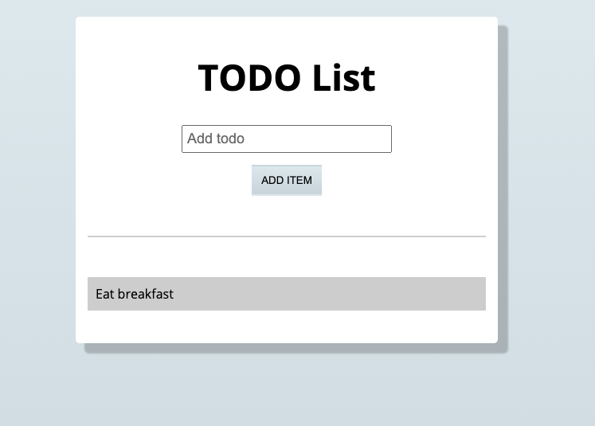

# Local Todos

A repo for M1 students to get more practice working with localStorage.

## Tasks

-  When a user clicks the "Add Item" button: 
    - the user should see that task displayed below
    - on refresh, that task should still be displayed

- When a user clicks a todo item:
  - the user should see that task removed from view
  - on refresh, that task should not reappear

## Considerations
- Which localStorage methods will you have to use to complete the above tasks?
- Think about how you will need to store multiple todo items and be able to save them in localStorage.
